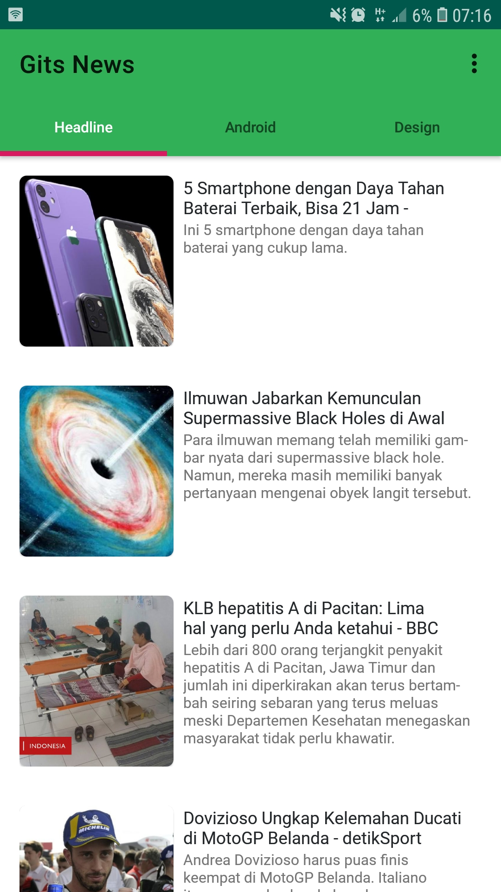
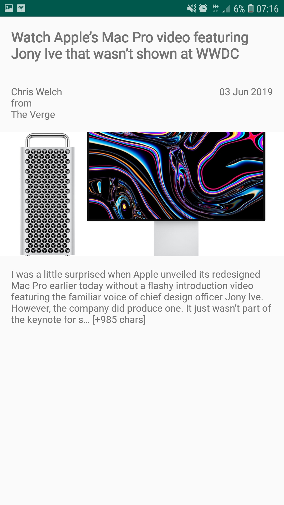

NewsApp Android Powered By NewsAPI.org

Tech Stark

- Kotlin
- Model-View-ViewModel (MVVM) Pattern
- RxJava
- Retrofit
- DataBinding
- Dagger (Dependency Injection)
- WebView
- Lottie Animation for loading

Upcoming features
-----------------
- Navigation Component
- Paging

Screenshots
-----------

Libraries Used
--------------
* [Picasso][0] for image loading

[0]: https://square.github.io/picasso/